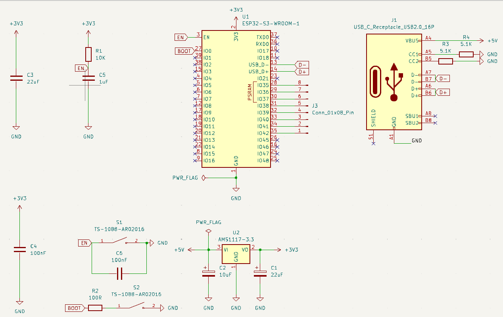
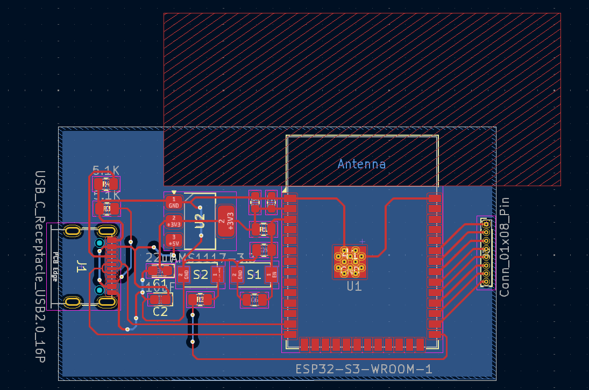
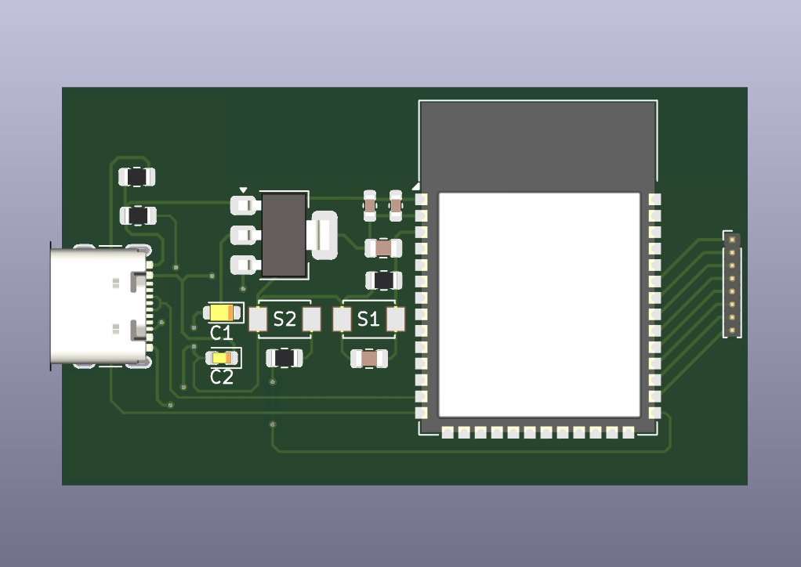

# Design ESP32
Proyek Design ESP32 merupakan pembuatan ESP32 dari awal, mulai dari penentuan komponen pembentuk, perancangan komponen, hingga pembuatan design PCB. Tujuan proyek ini adalah membangun sistem ESP32 yang simpel sebagai media pembelajaran.
## Komponen Pembentuk
1. ESP32 S3 WROOM1
2. Regulator LDO 3,3V **AMS1117**
3. Kapasitor bypass (**10µF, 100nF**)  
4. Resistor (**R1, R2, R3, dan R4**)
5. UCB C Receptacle
6. Pin Header 01 × 08
7. S1 (**EN**) dan S2 (**BOOT**)
## Prinsip Kerja
### 1. Power manajemen
-  USB C, menyuplai tegangan 5V.  
-  AMS1117, menurunkan tegangan dari 5V ke 3V. Tegangan 3V yang kemudaian menyuplai ESP32 dan komponen pasif.
### 2. EN dan BOOT
-  EN, untuk mereset board.  
-  BOOT, untuk masuk ke mode pemrograman atau flash mode.
### 3. Resistor dan Kapasitor
-  Digunakan untuk filter tegangan, debouncing tombol, dan stabilisasi startup ESP32.
### 4. USB Data D+, D-
-  Memungkinkan penggunaan USB-TTL eksternal untuk pemrograman via TX/RX.
### 5. Header pin
-  Digunakan sebagai pin I/O eksternal. Bisa dijadikan input, output, PWM, SPI, I2C, UART, dll.

## Cuplikan Schematic

## Cuplikan LayOut PCB

## Cuplikan 3D View

