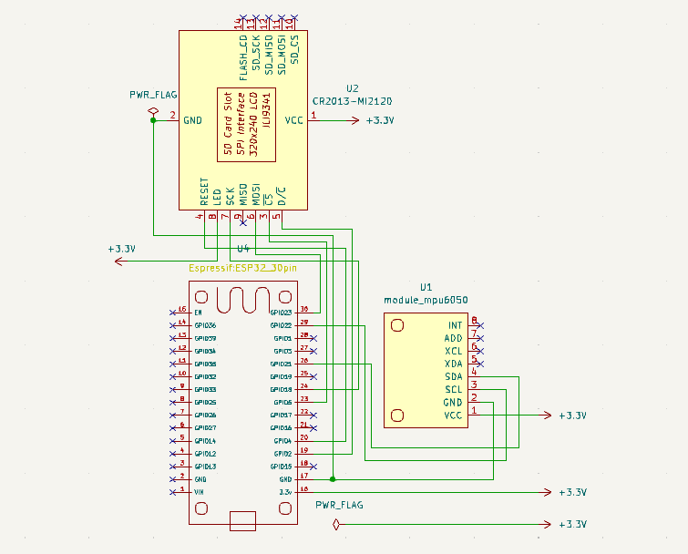

# ESP32 motion display module
Proyek ESP32 motion display module merupakan custom PCB untuk ESP32 yang diintegrasikan dengan sensor imo **MPU6050** dan LCD TFT **ILI9341**. Tujuannya yakni untuk dapat menampilkan nilai sudut kemiringan secara real-time dengan display.
## Komponen yang digunakan
-**ESP32 DEVKITV1**  : Mikrokontroler.  
-**MPU6050**         : Sensor accelerometer dan gyroscope 6-axis.  
-**ILI9341**         : Display.  
## Cuplikan Schematic

