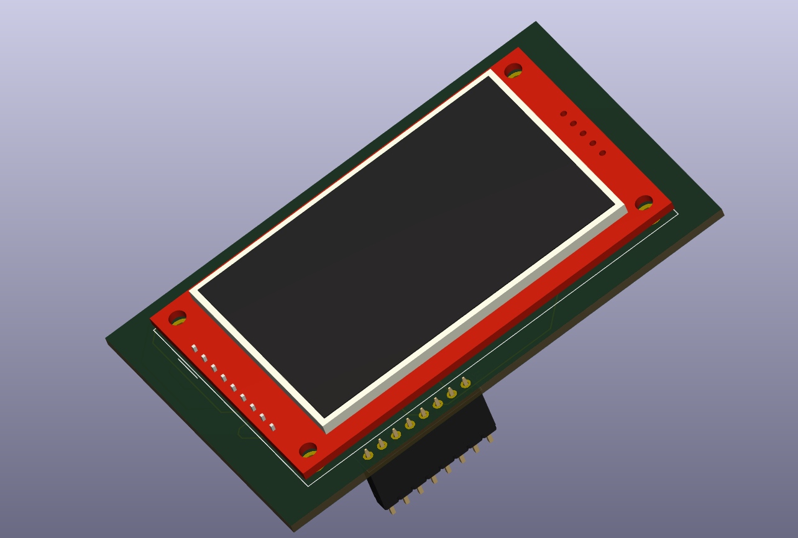

# ESP32 motion display module
Proyek ESP32 motion display module merupakan custom PCB untuk ESP32 yang diintegrasikan dengan sensor imo **MPU6050** dan LCD TFT **ILI9341**. Tujuannya yakni untuk dapat menampilkan nilai sudut kemiringan secara real-time dengan display.
## Komponen yang digunakan
-**ESP32 DEVKITV1**  : Mikrokontroler.  
-**MPU6050**         : Sensor accelerometer dan gyroscope 6-axis.  
-**ILI9341**         : Display.  
## Cuplikan Schematic

## kode Arduino IDE
```cpp  
#include <Wire.h>
#include <Adafruit_GFX.h>
#include <Adafruit_ILI9341.h>
#include <MPU6050.h>

// Pin konfigurasi untuk LCD TFT
#define TFT_CS     5
#define TFT_DC     2
#define TFT_RST    4

// Inisialisasi LCD TFT
Adafruit_ILI9341 tft = Adafruit_ILI9341(TFT_CS, TFT_DC, TFT_RST);

// Inisialisasi objek MPU6050
MPU6050 mpu;

void setup() {
  Serial.begin(115200);

  // Inisialisasi I2C MPU6050
  Wire.begin(21, 22); // SDA, SCL
  mpu.initialize();

  if (mpu.testConnection()) {
    Serial.println("MPU6050 connect");
  } else {
    Serial.println("Gagal connect ke MPU6050");
    while (1); // Berhenti
  }

  // Inisialisasi TFT
  tft.begin();
  tft.setRotation(1); // orientasi landscape
  tft.fillScreen(ILI9341_BLACK);
  tft.setTextSize(2);
  tft.setTextColor(ILI9341_WHITE);
}

void loop() {
  int16_t ax, ay, az;
  mpu.getAcceleration(&ax, &ay, &az);

  // menampilkan di serial monitor
  Serial.print("AX: "); Serial.print(ax);
  Serial.print(" AY: "); Serial.print(ay);
  Serial.print(" AZ: "); Serial.println(az);

  // membersihkan dan tampilkan di layar
  tft.fillScreen(ILI9341_BLACK);
  tft.setCursor(10, 20);
  tft.print("Accel X: "); tft.println(ax);

  tft.setCursor(10, 50);
  tft.print("Accel Y: "); tft.println(ay);

  tft.setCursor(10, 80);
  tft.print("Accel Z: "); tft.println(az);

  delay(500);
}
```
## Prinsip kerja
Prinsip kerja alat ini dimulai dari MPU6050 yang berfungsi sebagai sensor percepatan tiga sumbu (X, Y, Z). Sensor ini mendeteksi gerakan atau perubahan posisi, lalu mengirimkan data percepatan tersebut ke ESP32 melalui komunikasi I2C. ESP32 berperan sebagai pusat kontrol yang menerima, mengolah, dan menerjemahkan data percepatan dari sensor. Setelah data terbaca dan diproses, ESP32 mengirimkan hasilnya ke layar TFT LCD melalui komunikasi SPI. Tampilan pada layar diperbarui secara berkala untuk menunjukkan nilai percepatan terbaru dari ketiga sumbu. Dengan demikian, alat tersebut dapat digunakan untuk memantau gerakan atau orientasi secara real-time, yang divisualisasikan langsung melalui display yang mewakili nilai percepatan sumbu X, Y, dan Z.
## Cuplikan hasil custom PCB


